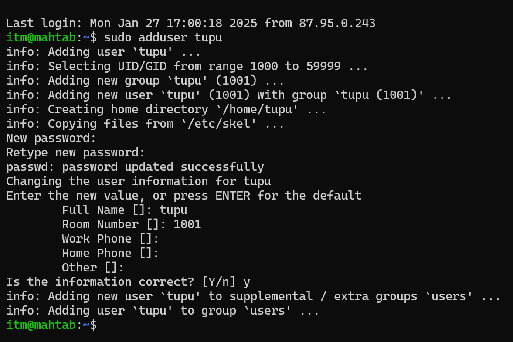
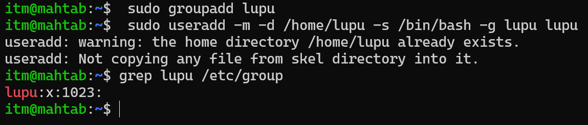
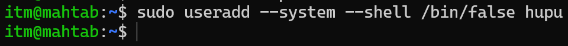
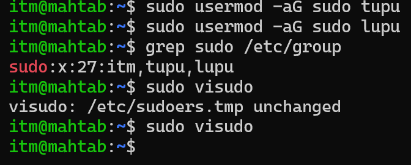
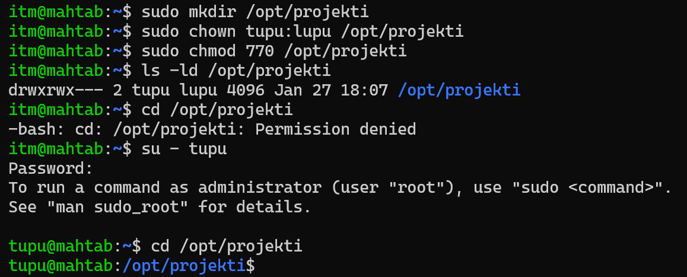

## 1/28/2025
I made 3 users where one of them are system users and added them in group and also make directory and change ownership.
### Task 1
I made a user called tupu a set everything for it.

### Task 2
I made another user called lupu and used useradd command for it. And made a lupu group and add user lupu to the group and verify it.

### Task 3 
I also create a system users called hupu

### Task 4
Added the user lupu and tupu to the sudo groups. And then verify it .

### Task 5
Created a directory /opt/projekti and add both users (Tupu and Lupu) as owners so that  Only Tupu and Lupu should have access to list files in the directory, read, and modify them. And then i verify it by user tupu.
